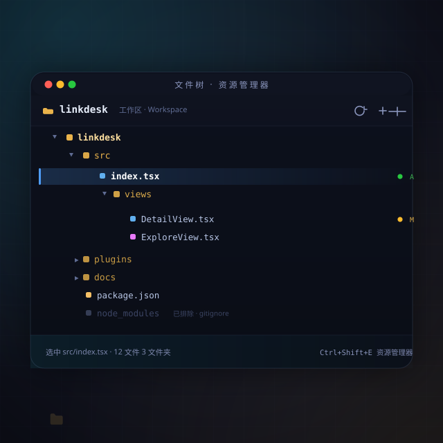

# 文件树（file-tree）

> LinkDesk 官方内置 · `core: true` · 对标 VS Code 资源管理器
> **理念一句话：** 侧栏那一列文件树，是 LinkDesk 通往磁盘的窗。它只管一件事——把「磁盘上的文件夹」摊成「能点、能拖、能搜的一棵树」，剩下的交给文件类型图标、打开方式、终端、编辑器。

## 这是什么

文件树插件往侧栏贡献「资源管理器」容器（`explorer`）与两个视图：

- **文件夹**（`folders`）——浏览目录树：双击开文件、回车开聚焦项、拖放移动/拷贝、新建/重命名/删除、剪切/复制/粘贴、收起所有
- **搜索**（`search`）——在文件夹里按内容搜（`Ctrl+Shift+F` 直达）

## 它能做什么

- **打开方式一整套** —— 普通打开、侧边打开（分屏）、「打开方式…」（交给装了对应能力的插件）、右键「在终端中打开」（选 PowerShell / Cmd / Windows Terminal / Git Bash 或自定义命令）
- **文件类型图标** —— 每行图标由「文件图标主题」驱动：`.c`/`.h`/`.py`… 各归各类，与编辑器打开的标签栏同一套（切 `app.iconTheme` 即时整批变）
- **装饰器** —— 颜色标记 / 徽章（改动的文件上点亮），可分别关
- **排序与嵌套** —— 默认/文件优先/类型/修改时间排序；紧凑文件夹单层压缩；文件嵌套把相关文件折进父文件（对标 VS Code）
- **排除规则** —— 读 `.gitignore` 自动排除 + `files.exclude` 自定义 glob
- **自动定位** —— 切编辑器标签时自动在树里高亮当前文件（`explorer.autoReveal`，可关）
- **重名递增命名** —— 新建重名文件自动 `-1`、`-2` 递增（或纯手动命名）
- **确认防线** —— 删除、拖放默认都弹确认，可分别关成静默

## 与编辑器标签栏的「同源」约定

它是文件图标主题机制的第一个消费方，也是默认消费方。文件图标数据与解析不在本插件里私有——它住在共享文件图标服务（一处），文件树每一行、编辑器文件标签、搜索结果行同消费；第三方作者也能按公开契约贡献新图标 / 整套文件图标主题，见 [06-图标.md](../../docs/02-Electron架构/E6_插件生态与发布/03-插件市场/06-图标.md)。

## 图标身份（E6#69 三图模型）

- `icon`（界面小图标）= `resources/icon-bar.svg` —— **Type-1 线稿剪影**（codicon files 字形），仅图标栏那枚竖排钮用
- `marketIcon`（市场/标签栏彩色身份图）= `resources/icon.svg` —— **Type-2 彩色块**（琥珀文件夹 + 白纸文件），市场列表行 = 详情顶同一张
- 场景封面见本 README 顶部 —— 不进市场展示位
